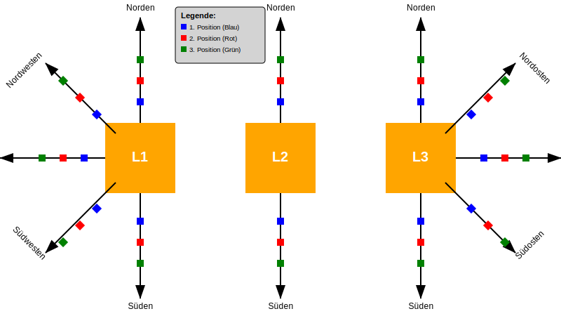

# Positionsberechnung für Kupferschienen

---

## Es gibt für verschiedene Stromstärken unterschiedliche Startpositionen der Kupferschienen

In der folgenden Tabelle sind die Startpositionen der Kupferschienen für verschiedene Stromstärken aufgeführt.

### Begriffe Erklärung

- **Translation:** ist eine Option um die gesamte Kupferschiene, von einer Stromstärke, zu verschieben. (x+x1_in=x1_res und y+y1_in=y1_res, gilt für L2 und L3 auch).
- **startPosL:** ist die Startposition der Kupferschiene für eine bestimmte Stromstärke. (L1, L2, L3)
- **x_in:** ist die Eingangsposition der Kupferschiene in x-Richtung (aus der Tabelle).
- **y_in:** ist die Eingangsposition der Kupferschiene in y-Richtung (aus der Tabelle).
- **x_res:** ist die Ausgangsposition der Kupferschiene in x-Richtung.
- **y_res:** ist die Ausgangsposition der Kupferschiene in y-Richtung.

|       | Translation | Translation | startPosL1 | startPosL1 | startPosL1 | startPosL1 | startPosL2 | startPosL2 | startPosL2 | startPosL2 | startPosL3 | startPosL3 | startPosL3 | startPosL3 |
| ----- | ----------- | ----------- | ---------- | ---------- | ---------- | ---------- | ---------- | ---------- | ---------- | ---------- | ---------- | ---------- | ---------- | ---------- |
| Strom | X           | Y           | x1_in      | x1_res     | y1_in      | y1_res     | x2_in      | x2_res     | y2_in      | y2_res     | x3_in      | x3_res     | y3_in      | y3_res     |
| 600   | 0           | 0           | -90        | -90        | 0          | 0          | 0          | 0          | 0          | 0          | 90         | 90         | 0          | 0          |
| 800   | 0           | 0           | -90        | -90        | 0          | 0          | 0          | 0          | 0          | 0          | 90         | 90         | 0          | 0          |
| 1000  | 0           | 0           | -90        | -90        | 0          | 0          | 0          | 0          | 0          | 0          | 90         | 90         | 0          | 0          |
| 1250  | 0           | 0           | -90        | -90        | 0          | 0          | 0          | 0          | 0          | 0          | 90         | 90         | 0          | 0          |
| 1600  | 0           | 0           | -90        | -90        | 0          | 0          | 0          | 0          | 0          | 0          | 90         | 90         | 0          | 0          |
| 2000  | 0           | 0           | -130       | -130       | 0          | 0          | 0          | 0          | 0          | 0          | 130        | 130        | 0          | 0          |
| 2500  | 0           | 0           | -130       | -130       | 0          | 0          | 0          | 0          | 0          | 0          | 130        | 130        | 0          | 0          |
| 3000  | 0           | 0           | -130       | -130       | 0          | 0          | 0          | 0          | 0          | 0          | 130        | 130        | 0          | 0          |
| 4000  | 0           | 0           | -210       | -210       | 0          | 0          | 0          | 0          | 0          | 0          | 210        | 210        | 0          | 0          |
| 5000  | 0           | 0           | -210       | -210       | 0          | 0          | 0          | 0          | 0          | 0          | 210        | 210        | 0          | 0          |

---

## Jeder Schaltschrank hat eine gewissen Platz indem die Kupferschienen positioniert werden können (Spielraum).

### Begriffe Erklärung

- **Spielraum:** ist ein Bereich, in dem die Kupferschienen positioniert werden können.
- **Länge:** ist die länge als platz im schaltschrank.
- **Breite:** ist die breite als platz im schaltschrank.
- **+maxX:** ist der maximale positive x-Wert im Spielraum.
- **+maxY:** ist der maximale positive y-Wert im Spielraum.
- **-maxX:** ist der maximale negative x-Wert im Spielraum.
- **-maxY:** ist der maximale negative y-Wert im Spielraum.

```math
+maxX = \frac{Breite}{2}\\ \ \\
+maxY = \frac{Höhe}{2}\\ \ \\
-maxX = -\frac{Breite}{2}\\ \ \\
-maxY = -\frac{Höhe}{2}\\ \ \\
```

| Länge | Breite | +maxX | -maxX | +maxY  | -maxY   |
| ----- | ------ | ----- | ----- | ------ | ------- |
| 680   | 232,5  | 340   | -340  | 116,25 | -116,25 |
| 680   | 232,5  | 340   | -340  | 116,25 | -116,25 |
| 680   | 232,5  | 340   | -340  | 116,25 | -116,25 |
| 680   | 232,5  | 340   | -340  | 116,25 | -116,25 |
| 680   | 232,5  | 340   | -340  | 116,25 | -116,25 |
| 680   | 232,5  | 340   | -340  | 116,25 | -116,25 |
| 680   | 232,5  | 340   | -340  | 116,25 | -116,25 |
| 680   | 232,5  | 340   | -340  | 116,25 | -116,25 |
| 680   | 232,5  | 340   | -340  | 116,25 | -116,25 |
| 680   | 232,5  | 340   | -340  | 116,25 | -116,25 |

---

## Bewegungsrichtung der Leiter

Die Leiter soll sich in die angegebene Richtung bewegen und positioniert werden, um verschiedene Messpositionen zu messen.

### Begriffe Erklärung

- **L1**: Die erste Bewegungsrichtung der Leiter.
- **L2**: Die zweite Bewegungsrichtung der Leiter.
- **L3**: Die dritte Bewegungsrichtung der Leiter.
- **PosGruppe**: Die Positionierungsgruppe der Leiter, wird in der darauffolgenden Tabelle angezeigt.

| L1           | L2       | L3           | PosGruppe |
| ------------ | -------- | ------------ | --------- |
| ← Westen     |          | → Osten      | Pos11     |
| ← Westen     |          | → Osten      | Pos12     |
| ← Westen     |          | → Osten      | Pos13     |
| ↙️ Südwesten |          | ↗️ Nordosten | Pos21     |
| ↙️ Südwesten |          | ↗️ Nordosten | Pos22     |
| ↙️ Südwesten |          | ↗️ Nordosten | Pos23     |
| ↓ Süden      | ↑ Norden | ↓ Süden      | Pos31     |
| ↓ Süden      | ↑ Norden | ↓ Süden      | Pos32     |
| ↓ Süden      | ↑ Norden | ↓ Süden      | Pos33     |
| ↙️ Südwesten | ↑ Norden | ↘️ Südosten  | Pos41     |
| ↙️ Südwesten | ↑ Norden | ↘️ Südosten  | Pos42     |
| ↙️ Südwesten | ↑ Norden | ↘️ Südosten  | Pos43     |

## Schrittweite der Leiter

Für jeden Strom der Kupferschienen wird die Schrittweite in den verschiedenen Positionen angegeben.

| Strom | Pos1 | Pos2 | Pos3 |
| ----- | ---- | ---- | ---- |
| 600   | 10   | 20   | 30   |
| 800   | 10   | 20   | 30   |
| 1000  | 10   | 20   | 30   |
| 1250  | 10   | 20   | 30   |
| 1600  | 10   | 20   | 30   |
| 2000  | 10   | 20   | 30   |
| 2500  | 10   | 20   | 30   |
| 3000  | 10   | 20   | 30   |
| 4000  | 10   | 20   | 30   |
| 5000  | 10   | 20   | 30   |



---

1. Startpositionen der Kupferschienen

2. Spielraum für die Kupferschienen

3. Positionsberechnung für jede Stromstärke mit einer Schrittweite

4. Endposition Kupferschine nach Positionsänderung

5. Kollisionsprüfung: Es soll geprüft werden, ob der Wandler und die Kupferschiene für den Spielraum nicht mit dem Rand kollidieren. (Abstand von 20 mm gilt für alles)

6. Endposition der Kupferschine nach Positionsänderung soll als Tabelle angezeigt werden für jede Stromstärke

|       |           | endPosL1 | endPosL1 | endPosL2 | endPosL2 | endPosL3 | endPosL2 |
| ----- | --------- | -------- | -------- | -------- | -------- | -------- | -------- |
| Strom | PosGruppe | x1_res   | y1_res   | x2_res   | y2_res   | x3_res   | y3_res   |
| 600   | Pos11     | -10      | 0        | 0        | 0        | 20       | 0        |
| 600   | Pos12     | -20      | 0        | 0        | 0        | 40       | 0        |
| 600   | Pos13     | -30      | 0        | 0        | 0        | 60       | 0        |
| 600   | Pos21     | -20      | -20      | 0        | 0        | 20       | 20       |
| 600   | Pos22     | -40      | -40      | 0        | 0        | 40       | 40       |
| 600   | Pos23     | -60      | -60      | 0        | 0        | 60       | 60       |
| 600   | Pos31     | -10      | -20      | 0        | 20       | 0        | -20      |
| 600   | Pos32     | -20      | -40      | 0        | 40       | 0        | -40      |
| 600   | Pos33     | -30      | -60      | 0        | 60       | 0        | -60      |
| 600   | Pos41     | -20      | -20      | 0        | 20       | 20       | -20      |
| 600   | Pos42     | -40      | -40      | 0        | 40       | 40       | -40      |
| 600   | Pos43     | -60      | -60      | 0        | 60       | 60       | -60      |
| 800   | Pos11     | res_end  | res_end  | res_end  | res_end  | res_end  | res_end  |
| 800   | Pos12     |          |          |          |          |          |          |
| 800   | Pos13     |          |          |          |          |          |          |
| 800   | Pos21     |          |          |          |          |          |          |
| 800   | Pos22     |          |          |          |          |          |          |

die Tabelle ist dann für jede Stromstärke gleich aufgebaut. Es soll über ein Dropdown ausgewählt werden können, welche Stromstärke angezeigt werden soll.
Es sollen alle Ergebnise in einer CSV Datei gespeichert werden.

7. Grafische Darstellung: Die Positionen der Kupferschienen und der Wandler sollen grafisch dargestellt werden.

```svg
<svg width="800" height="450" viewBox="0 0 800 450" xmlns="http://www.w3.org/2000/svg">
<defs>
<marker id="arrowhead" markerWidth="10" markerHeight="7" refX="9.5" refY="3.5" orient="auto">
<polygon points="0 0, 10 3.5, 0 7" fill="black" />
</marker>
</defs>

<g transform="translate(250, 10) scale(0.8)">
  <rect x="0" y="0" width="160" height="100" fill="lightgray" stroke="black" stroke-width="1.25" rx="5" ry="5"/>
  <text x="10" y="20" font-family="Arial, sans-serif" font-size="14" font-weight="bold">Legende:</text>
  <rect x="10" y="30" width="10" height="10" fill="blue" />
  <text x="25" y="40" font-family="Arial, sans-serif" font-size="12">1. Position (Blau)</text>
  <rect x="10" y="50" width="10" height="10" fill="red" />
  <text x="25" y="60" font-family="Arial, sans-serif" font-size="12">2. Position (Rot)</text>
  <rect x="10" y="70" width="10" height="10" fill="green" />
  <text x="25" y="80" font-family="Arial, sans-serif" font-size="12">3. Position (Grün)</text>
</g>

  <g id="leiter1">
    <rect x="150" y="175" width="100" height="100" fill="orange" />
    <text x="200" y="230" font-family="Arial, sans-serif" font-size="20" text-anchor="middle" fill="white" font-weight="bold">L1</text>

    <g>
      <line x1="200" y1="175" x2="200" y2="25" stroke="black" stroke-width="2" marker-end="url(#arrowhead)" />
      <text x="200" y="15" font-family="Arial, sans-serif" font-size="12" text-anchor="middle">Norden</text>
      <rect x="195" y="140" width="10" height="10" fill="blue" />
      <rect x="195" y="110" width="10" height="10" fill="red" />
      <rect x="195" y="80" width="10" height="10" fill="green" />
    </g>

    <g>
      <line x1="200" y1="275" x2="200" y2="425" stroke="black" stroke-width="2" marker-end="url(#arrowhead)" />
      <text x="200" y="440" font-family="Arial, sans-serif" font-size="12" text-anchor="middle">Süden</text>
      <rect x="195" y="310" width="10" height="10" fill="blue" />
      <rect x="195" y="340" width="10" height="10" fill="red" />
      <rect x="195" y="370" width="10" height="10" fill="green" />
    </g>

    <g>
      <line x1="150" y1="225" x2="0" y2="225" stroke="black" stroke-width="2" marker-end="url(#arrowhead)" />
      <text x="-15" y="230" font-family="Arial, sans-serif" font-size="12" text-anchor="end">Westen</text>
      <rect x="115" y="220" width="10" height="10" fill="blue" />
      <rect x="85" y="220" width="10" height="10" fill="red" />
      <rect x="55" y="220" width="10" height="10" fill="green" />
    </g>

    <g>
      <line x1="165" y1="190" x2="65" y2="90" stroke="black" stroke-width="2" marker-end="url(#arrowhead)" />
      <text x="60" y="80" font-family="Arial, sans-serif" font-size="12" text-anchor="end" transform="rotate(-45 60 80)">Nordwesten</text>
      <rect x="133" y="158" width="10" height="10" fill="blue" transform="rotate(-45 138 163)" />
      <rect x="109" y="134" width="10" height="10" fill="red" transform="rotate(-45 114 139)" />
      <rect x="85" y="110" width="10" height="10" fill="green" transform="rotate(-45 90 115)" />
    </g>

    <g>
      <line x1="165" y1="260" x2="65" y2="360" stroke="black" stroke-width="2" marker-end="url(#arrowhead)" />
      <text x="60" y="370" font-family="Arial, sans-serif" font-size="12" text-anchor="end" transform="rotate(45 60 370)">Südwesten</text>
      <rect x="133" y="292" width="10" height="10" fill="blue" transform="rotate(45 138 297)" />
      <rect x="109" y="316" width="10" height="10" fill="red" transform="rotate(45 114 321)" />
      <rect x="85" y="340" width="10" height="10" fill="green" transform="rotate(45 90 345)" />
    </g>

  </g>

  <g id="leiter2">
    <rect x="350" y="175" width="100" height="100" fill="orange" />
    <text x="400" y="230" font-family="Arial, sans-serif" font-size="20" text-anchor="middle" fill="white" font-weight="bold">L2</text>

    <g>
      <line x1="400" y1="175" x2="400" y2="25" stroke="black" stroke-width="2" marker-end="url(#arrowhead)" />
      <text x="400" y="15" font-family="Arial, sans-serif" font-size="12" text-anchor="middle">Norden</text>
      <rect x="395" y="140" width="10" height="10" fill="blue" />
      <rect x="395" y="110" width="10" height="10" fill="red" />
      <rect x="395" y="80" width="10" height="10" fill="green" />
    </g>

    <g>
      <line x1="400" y1="275" x2="400" y2="425" stroke="black" stroke-width="2" marker-end="url(#arrowhead)" />
      <text x="400" y="440" font-family="Arial, sans-serif" font-size="12" text-anchor="middle">Süden</text>
      <rect x="395" y="310" width="10" height="10" fill="blue" />
      <rect x="395" y="340" width="10" height="10" fill="red" />
      <rect x="395" y="370" width="10" height="10" fill="green" />
    </g>
  </g>

  <g id="leiter3">
    <rect x="550" y="175" width="100" height="100" fill="orange" />
    <text x="600" y="230" font-family="Arial, sans-serif" font-size="20" text-anchor="middle" fill="white" font-weight="bold">L3</text>

    <g>
      <line x1="600" y1="175" x2="600" y2="25" stroke="black" stroke-width="2" marker-end="url(#arrowhead)" />
      <text x="600" y="15" font-family="Arial, sans-serif" font-size="12" text-anchor="middle">Norden</text>
      <rect x="595" y="140" width="10" height="10" fill="blue" />
      <rect x="595" y="110" width="10" height="10" fill="red" />
      <rect x="595" y="80" width="10" height="10" fill="green" />
    </g>

    <g>
      <line x1="600" y1="275" x2="600" y2="425" stroke="black" stroke-width="2" marker-end="url(#arrowhead)" />
      <text x="600" y="440" font-family="Arial, sans-serif" font-size="12" text-anchor="middle">Süden</text>
      <rect x="595" y="310" width="10" height="10" fill="blue" />
      <rect x="595" y="340" width="10" height="10" fill="red" />
      <rect x="595" y="370" width="10" height="10" fill="green" />
    </g>

    <g>
      <line x1="650" y1="225" x2="800" y2="225" stroke="black" stroke-width="2" marker-end="url(#arrowhead)" />
      <text x="815" y="230" font-family="Arial, sans-serif" font-size="12" text-anchor="start">Osten</text>
      <rect x="685" y="220" width="10" height="10" fill="blue" />
      <rect x="715" y="220" width="10" height="10" fill="red" />
      <rect x="745" y="220" width="10" height="10" fill="green" />
    </g>

    <g>
      <line x1="635" y1="190" x2="735" y2="90" stroke="black" stroke-width="2" marker-end="url(#arrowhead)" />
      <text x="740" y="80" font-family="Arial, sans-serif" font-size="12" text-anchor="start" transform="rotate(45 740 80)">Nordosten</text>
      <rect x="667" y="158" width="10" height="10" fill="blue" transform="rotate(45 672 163)" />
      <rect x="691" y="134" width="10" height="10" fill="red" transform="rotate(45 696 139)" />
      <rect x="715" y="110" width="10" height="10" fill="green" transform="rotate(45 720 115)" />
    </g>

    <g>
      <line x1="635" y1="260" x2="735" y2="360" stroke="black" stroke-width="2" marker-end="url(#arrowhead)" />
      <text x="740" y="370" font-family="Arial, sans-serif" font-size="12" text-anchor="start" transform="rotate(-45 740 370)">Südosten</text>
      <rect x="667" y="292" width="10" height="10" fill="blue" transform="rotate(-45 672 297)" />
      <rect x="691" y="316" width="10" height="10" fill="red" transform="rotate(-45 696 321)" />
      <rect x="715" y="340" width="10" height="10" fill="green" transform="rotate(-45 720 345)" />
    </g>

  </g>
</svg>
```
